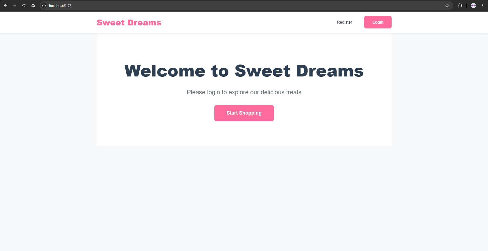

# Sweet Shop Management System

This is a full-stack web application for managing a sweet shop's inventory and sales. The project was built as a TDD Kata to demonstrate skills in modern backend and frontend development, including API design, database management, and the use of AI development tools.

The backend is a robust RESTful API built with Python and FastAPI, featuring JWT-based authentication and role-based permissions. The frontend is a dynamic single-page application built with React, providing a seamless user experience for both customers and administrators.

---

## Screenshots

**Home Page**


**Login Page**


**Main Dashboard**


**Admin Panel**


---

## Technology Stack

* **Backend**: Python (FastAPI)
* **Database**: PostgreSQL
* **Frontend**: React (Vite)
* **Styling**: Custom CSS

---

## Setup and Run Instructions

Follow these steps to set up and run the project locally. The project is structured as a monorepo containing both the backend and frontend.

### 1. Backend Setup

First, navigate to the root directory of the project.

```bash
# Create and activate a Python virtual environment
python -m venv venv

# On Windows
.\venv\Scripts\activate

# On macOS/Linux
source venv/bin/activate

# Install backend dependencies
pip install -r requirements.txt

# Make sure your PostgreSQL database is running.
# The connection string in `database.py` should be configured to point to it.

# Run the backend server
uvicorn main:app --reload
```
The backend will be running at `http://127.0.0.1:8000`.

### 2. Frontend Setup

Open a **new terminal** and navigate into the frontend directory from the project root.

```bash
cd sweet-shop-frontend

# Install frontend dependencies
npm install

# Run the frontend development server
npm run dev
```
The frontend will be running at `http://localhost:5173` (or a similar port).

---

