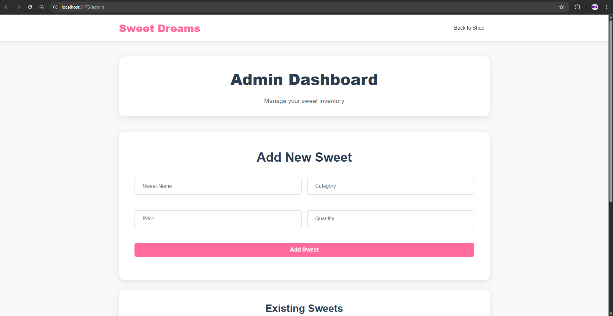

# Sweet Shop Management System

This is a full-stack web application for managing a sweet shop's inventory and sales. The project was built as a TDD Kata to demonstrate skills in modern backend and frontend development, including API design, database management, and the use of AI development tools.

The backend is a robust RESTful API built with Python and FastAPI, featuring JWT-based authentication and role-based permissions. The frontend is a dynamic single-page application built with React, providing a seamless user experience for both customers and administrators.

---

## Screenshots

**Home Page**


**Login Page**


**Main Dashboard**


**Admin Panel**



---

## Technology Stack

* **Backend**: Python (FastAPI)
* **Database**: PostgreSQL
* **Frontend**: React (Vite)
* **Styling**: Custom CSS

---

## Setup and Run Instructions

Follow these steps to set up and run the project locally. The project is structured as a monorepo containing both the backend and frontend.

### 1. Backend Setup

First, navigate to the root directory of the project.

```bash
# Create and activate a Python virtual environment
python -m venv venv

# On Windows
.\venv\Scripts\activate

# On macOS/Linux
source venv/bin/activate

# Install backend dependencies
pip install -r requirements.txt

# Make sure your PostgreSQL database is running.
# The connection string in `database.py` should be configured to point to it.

# Run the backend server
uvicorn main:app --reload
```
The backend will be running at `http://127.0.0.1:8000`.

### 2. Frontend Setup

Open a **new terminal** and navigate into the frontend directory from the project root.

```bash
cd sweet-shop-frontend

# Install frontend dependencies
npm install

# Run the frontend development server
npm run dev
```
The frontend will be running at `http://localhost:5173` (or a similar port).

---
## My AI Usage

* **AI Tool(s) Used**: Gemini, Claude

* **How I Used It**:
    * I used Gemini as an interactive, step-by-step pair-programming assistant for the entire project lifecycle.
    * **Backend Development**: Gemini provided the code for setting up the FastAPI server, defining database models, implementing JWT authentication, and creating all CRUD and inventory management endpoints.
    * **Frontend Development**: It guided the creation of the React application, including setting up the project with Vite, creating components for each page, implementing state management with React Context, and connecting the frontend to the backend API.
    * **Debugging**: Gemini was instrumental in debugging a wide range of issues, including CORS errors, Python dependency conflicts (`bcrypt`), Python import errors, and frontend layout problems.
    * **Best Practices & Alternatives**: It explained professional concepts like Test-Driven Development (though I opted for a direct implementation), project structure (monorepo), and provided alternative UI libraries.
    * **Final UI Implementation**: Towards the end of the project, I used Claude to refactor the initial frontend styling, implementing the final design using custom CSS.
    * **Documentation**: Gemini generated the final template for this README file.

* **My Reflection**:
    Honestly, I was surprised by how much using an AI assistant felt like working with a real pair-programmer. It was great for getting the project off the ground quickly. Instead of spending a ton of time on setup and boilerplate code, I could get straight to the fun parts of building the actual features.

    The biggest win for me was definitely debugging. There were a few times I got completely stuck on issues like CORS errors or weird Python dependency conflicts. These are the kinds of problems that can eat up an entire afternoon. Being able to just paste the error and get a direct, accurate fix was a lifesaver. It kept the project moving and saved me a huge amount of frustration.

    In the end, I was still the one making the key decisions. The AI didn't build the app *for* me; it built it *with* me. It's a powerful tool that helped me work faster and learn things along the way, and I'm pretty sure I finished this project in a fraction of the time it would have taken me on my own.